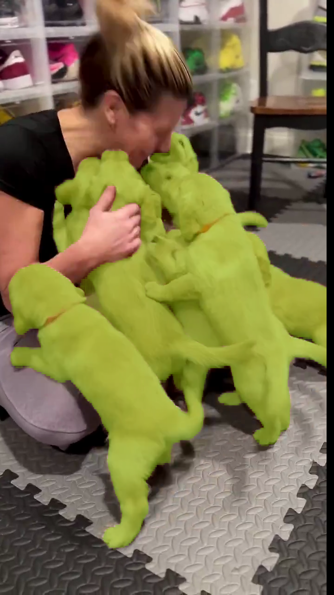
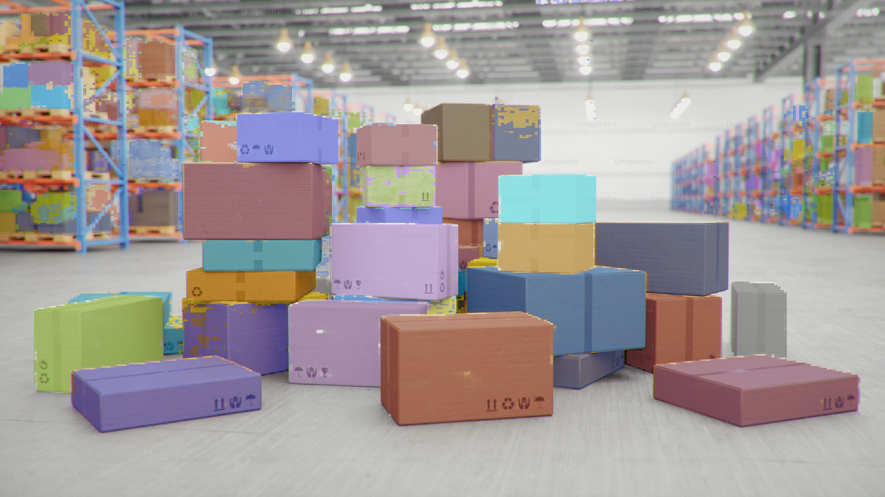

# SAM3 to TensorRT

Export Meta AI's Segment Anything 3 (SAM3) model to ONNX, then build a TensorRT engine for real-time segmentation. This repo now includes a C++/CUDA inference library and demo apps for both semantic and instance segmentation.

## Project Overview
- Python tooling to export SAM3 to a clean ONNX graph.
- TensorRT-ready workflows for building optimized engines.
- A C++/CUDA library for high-performance inference with demo apps.
- Zero-copy support on unified-memory platforms (Jetson, DGX Spark).
- Everything runs inside a reproducible docker environment (x86; see Jetson section for aarch64).
- Semantic and instance segmentation outputs demonstrated in `demo/`.

## Repo Layout
- `python/` - ONNX export and visualization scripts.
- `cpp/` - C++/CUDA library and apps (TensorRT inference).
- `docker/` - Container setup (`Dockerfile.x86`, with an aarch64 variant expected).
- `demo/` - Example outputs from the C++ demo app.

## Quickstart
1) Build and start the Docker container (x86, all commands below run inside it)
```bash
docker build -t sam3-trt -f docker/Dockerfile.x86 .
docker run -it --rm \
  --network=host \
  --gpus all \
  --ipc=host \
  --ulimit memlock=-1 \
  --ulimit stack=67108864 \
  --runtime=nvidia \
  --env HF_TOKEN \
  -v "$PWD":/workspace \
  -w /workspace \
  sam3-trt bash
```

2) Request access to the gated model
   - Visit https://huggingface.co/facebook/sam3 and request access.
   - Ensure your `HF_TOKEN` has permission.

3) Install Python dependencies for export
```bash
pip install torch transformers pillow requests
```
If SAM3 is missing from your installed `transformers`, install from source:
```bash
git clone https://github.com/huggingface/transformers.git
cd transformers
pip install '.[torch]'
```

4) Export to ONNX
```bash
export HF_TOKEN=<YOUR TOKEN>
python python/onnxexport.py
```
This produces `onnx_weights/sam3_static.onnx` plus external weight shards.

5) Build a TensorRT engine
```bash
trtexec --onnx=onnx_weights/sam3_static.onnx --saveEngine=sam3_fp16.plan --fp16 --verbose
```
Other precisions:
```bash
trtexec --onnx=onnx_weights/sam3_static.onnx --saveEngine=sam3_int8.plan --int8 --verbose
trtexec --onnx=onnx_weights/sam3_static.onnx --saveEngine=sam3_fp8.plan --fp8 --verbose
trtexec --onnx=onnx_weights/sam3_static.onnx --saveEngine=sam3_int4.plan --int4 --verbose
```

6) Build the C++/CUDA apps
```bash
cmake -S cpp -B build
cmake --build build -j
```
Dependencies: CUDA, TensorRT, and OpenCV (via pkg-config).

7) Run the demo app
```bash
./build/sam3_pcs_app <image_dir> <engine_path.engine>
```
Results are written to a `results/` folder.

## Jetson / DGX Spark
For aarch64 platforms with shared CPU/GPU memory, the C++/CUDA library supports zero-copy inference paths.

Build and run the aarch64 container:
```bash
docker build -t sam3-trt-aarch64 -f docker/Dockerfile.aarch64 .
docker run -it --rm --network=host --runtime=nvidia \
  --env HF_TOKEN -v "$PWD":/workspace -w /workspace sam3-trt-aarch64 bash
```
Note: `docker/Dockerfile.aarch64` is expected to mirror the x86 Dockerfile with a compatible base image and deps.

## Demos
Semantic and instance segmentation produced by the C++ demo app:

| Semantic segmentation | Instance segmentation |
| --- | --- |
|  |  |

## Extensions
Ideas to extend this project:
- ROS2 wrapper for real-time robotics pipelines.
- Interactive voice-based segmentation app (speech prompt to mask).
- Web or GUI viewer for live camera input and overlays.

## Troubleshooting
- **Access errors:** Make sure your `HF_TOKEN` has access to `facebook/sam3`.
- **ONNX export fails:** Install `transformers` from source if SAM3 is missing.
- **TensorRT parse errors:** Ensure the full `onnx_weights/` directory is copied (external data is required).
- **C++ build errors:** Confirm CUDA, TensorRT, and OpenCV are installed and discoverable via `pkg-config`.

## Miscellaneous
### Highlights
- Minimal Python export that produces a clean ONNX graph.
- TensorRT-focused inference pipeline.
- C++/CUDA library designed for production-style throughput.
- Zero-copy inference on unified-memory platforms (Jetson, DGX Spark).

### C++/CUDA Library Notes
- The shared library target is `sam3_trt`.
- Demo app: `sam3_pcs_app` (semantic/instance visualization modes).

### ONNX Export Details
- Default export runs on CPU for compatibility (switch `device` to `cuda` if desired).
- Outputs include instance masks (`pred_masks`) and semantic mask logits.
- SAM3 is large and exports with external weight shards; keep the entire `onnx_weights/` directory together.

### TensorRT Notes
- Use `trtexec` for quick engine builds and benchmarking.
- FP16 is the usual starting point; INT8/FP8/INT4 require calibration or compatible tooling.

### License
- MIT (see `LICENSE`).
